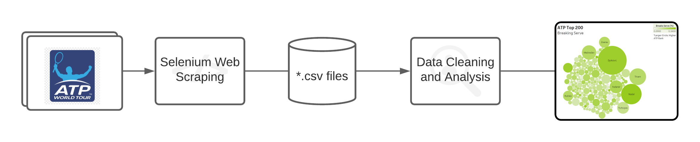

# ATP Top 200 Data Analysis with Model :tennis:

## Summary

I've played tennis my whole life and have always enjoyed watching the pros. The Association of Tennis Professionals (ATP) uses a point-based system to rank the top tennis players in the world. There are hundreds of players in the ATP, but the top 10 or so usually stand out from the rest, and I wanted to figure out why this is. What is it about the very best players that allows them to stand out from the rest of the pack? Are they just bigger? Do they hit their first serve in more consistently? There are definitely a few possibilities to explore, and my goal was to identify the key features of the top ATP players that seperate them from the rest. I scraped data from the official ATP site using Selenium and fit a linear regression model to the data. From there, I was able to pinpoint the most important features and create some visualizations.

## The Process (Summarized) :recycle:

## Technologies Used :microscope:

## The Results :heavy_check_mark:

## What I Learned :books:

## Future Implementations :rocket:
