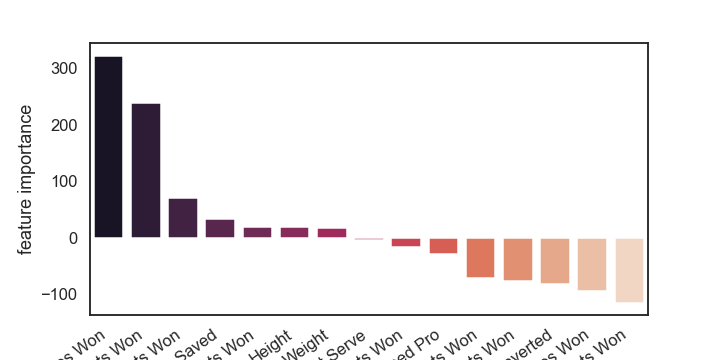
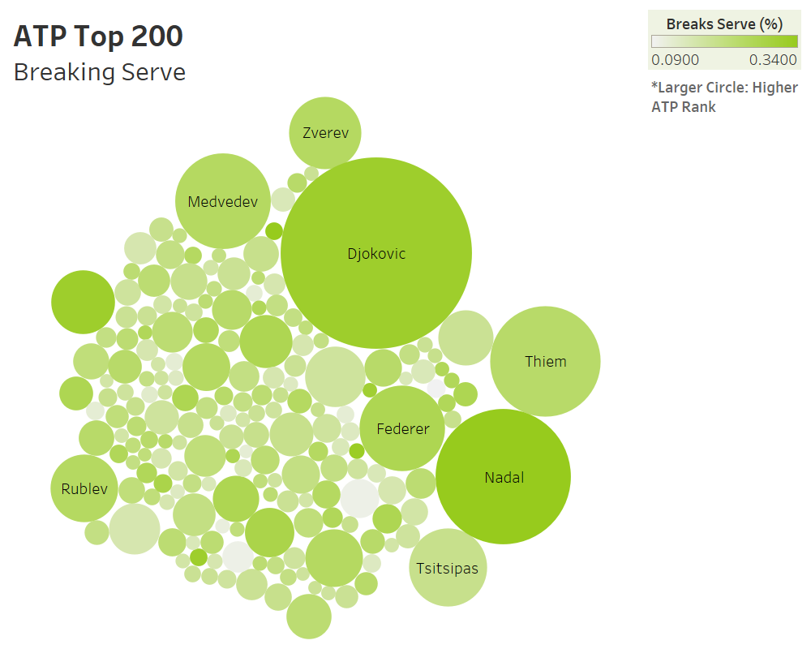
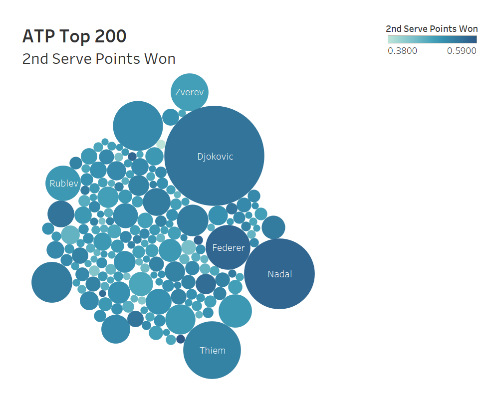
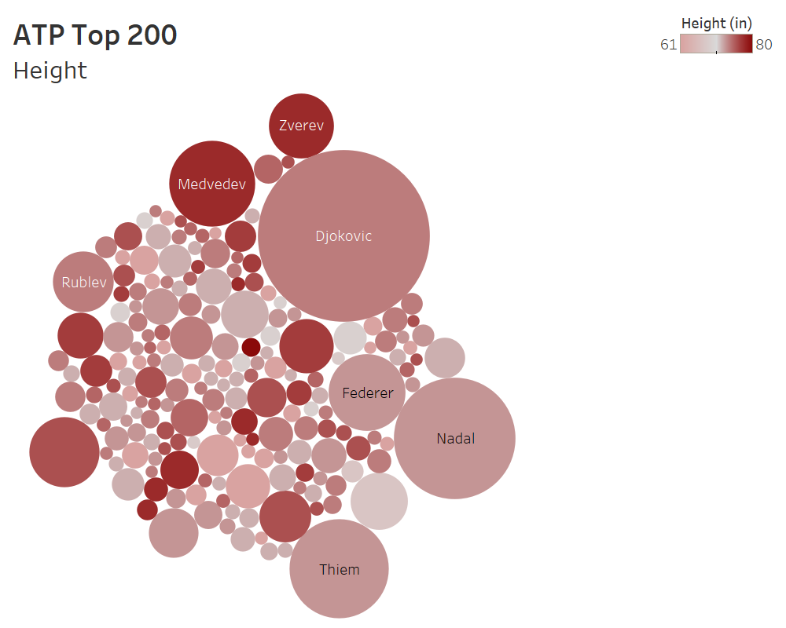

# ATP Top 200 Data Analysis with Model :tennis:

## Summary

I've played tennis my whole life and have always enjoyed watching the pros. The Association of Tennis Professionals (ATP) uses a point-based system to rank the top tennis players in the world. There are hundreds of players in the ATP, but the top 10 or so usually stand out from the rest, and I wanted to figure out why this is. What is it about the very best players that allows them to stand out from the rest of the pack? Are they just bigger? Do they hit their first serve in more consistently? There are definitely a few possibilities to explore, and my goal was to identify the key features of the top ATP players that seperate them from the rest. I scraped data from the official ATP site using Selenium and fit a linear regression model to the data. From there, I was able to pinpoint the most important features and create some visualizations.

## The Process (Summarized) :recycle:

## Technologies Used :microscope:

- Python Libraries: pandas, numpy, matplotlib, seaborn, scikit-learn
- Selenium Web Scraping, Data Processing, Data Analysis, Feature Engineering, Machine Learning, Visualization
- Visualization Tools: Tableau

## The Results :heavy_check_mark:

While I would have liked to use BeautifulSoup to scrape the web data, the site architecture forced me to use Selenium as a scraping tool. The data that I extracted was unorganized, and quite honestly pretty messy. I spent some time cleaning everything up in different sections and then concatenated all of the files into one. After some exploratory data analysis, I chose to modify a few features before taking the normal preprocessing steps such as dropping 'na' rows and using a MinMaxScaler. This part wasn't too bad since most of the data was in terms of percentages. I then fit the data to a basic linear regression model using scikit-learn and used various sklearn methods to pull out a feature importance matrix, shown here (sorry about the plt.savefig crop):

'Return Games Won' had the highest weight assigned to it out of all of the possible features. This data represents the percentage of the time that a given player won a game, given that they were not serving. This is known as 'breaking serve', which is usually more difficult than 'holding serve', which is when a player wins a game given that they *were* serving. It's an interesting result, but as a lifeling tennis player I was not particularly surprised. Here is a visualization generated using Tableau that demonstrates the importance of winning return games:

Here is a similar visual demonstrating the importance of winning points on a second serve:

And finally, this is what the visual looks like if we use a feature without much weight added to it, such as height:

I was somewhat surprised that height did not seem to be much of a factor, but I do think it is important to note that the average height among the ATP Top 200 is about 6'1", significantly taller than the global median.

## What I Learned :books:

## Future Implementations :rocket:

